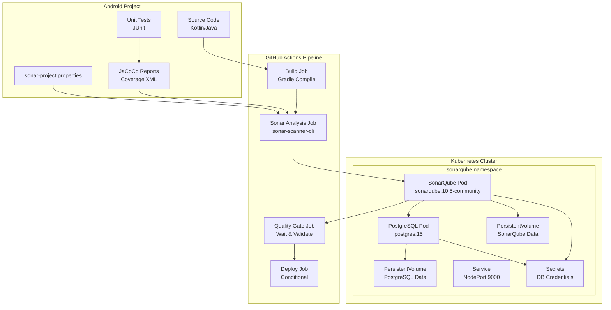

# Documento de Diseño

## Resumen

Este documento describe el diseño arquitectónico para implementar un sistema completo de análisis de calidad de código usando SonarQube desplegado en Kubernetes, con integración CI/CD mediante GitHub Actions que bloquee automáticamente despliegues de proyectos Android que no cumplan con estándares de calidad mínimos.

El sistema consta de tres componentes principales:
1. **Infraestructura Kubernetes** - SonarQube y PostgreSQL con almacenamiento persistente
2. **Configuración SonarQube** - Quality Gates y reglas de análisis para Android
3. **Pipeline GitHub Actions** - Automatización de análisis y bloqueo de despliegues

## Arquitectura



## Componentes e Interfaces

### 1. Infraestructura Kubernetes

#### Despliegue SonarQube
- **Image**: `sonarqube:10.5-community`
- **Resources**: 2 CPU, 4Gi RAM (recommended)
- **Ports**: 9000 (HTTP)
- **Environment Variables**:
  - `SONAR_JDBC_URL`: PostgreSQL connection string
  - `SONAR_JDBC_USERNAME`: Database username
  - `SONAR_JDBC_PASSWORD`: Database password (from Secret)
- **Volumes**: 
  - `/opt/sonarqube/data` → PersistentVolume (10Gi)
  - `/opt/sonarqube/logs` → EmptyDir
  - `/opt/sonarqube/extensions` → EmptyDir

#### Despliegue PostgreSQL
- **Image**: `postgres:15`
- **Resources**: 1 CPU, 2Gi RAM
- **Environment Variables**:
  - `POSTGRES_DB`: sonarqube
  - `POSTGRES_USER`: sonarqube
  - `POSTGRES_PASSWORD`: (from Secret)
- **Volumes**: `/var/lib/postgresql/data` → PersistentVolume (20Gi)

#### Servicios y Redes
- **SonarQube Service**: NodePort on 30900 or Ingress
- **PostgreSQL Service**: ClusterIP (internal only)
- **Namespace**: `sonarqube`

### 2. Configuración SonarQube

#### Reglas del Quality Gate
```yaml
Quality Gate: "Android Strict"
Conditions:
  - Coverage: >= 80%
  - Bugs (Blocker): = 0
  - Bugs (Critical): = 0
  - Vulnerabilities (High): = 0
  - Vulnerabilities (Critical): = 0
  - Code Smells (Blocker): = 0
  - Duplicated Lines: <= 3%
  - Maintainability Rating: <= A
  - Reliability Rating: <= A
  - Security Rating: <= A
```

#### Configuración del Proyecto
```properties
# sonar-project.properties
sonar.projectKey=android_app
sonar.projectName=AndroidApp
sonar.projectVersion=1.0
sonar.sources=app/src/main/java,app/src/main/kotlin
sonar.tests=app/src/test/java,app/src/test/kotlin
sonar.java.binaries=app/build/intermediates/javac,app/build/tmp/kotlin-classes
sonar.java.libraries=app/build/intermediates/compile_and_runtime_not_namespaced_r_class_jar
sonar.android.lint.report=app/build/reports/lint-results.xml
sonar.coverage.jacoco.xmlReportPaths=app/build/reports/jacoco/testDebugUnitTestCoverage/testDebugUnitTestCoverage.xml
sonar.language=kotlin
sonar.sourceEncoding=UTF-8

# Exclusions
sonar.coverage.exclusions=**/R.java,**/R$*.java,**/BuildConfig.*,**/Manifest*.*,**/*Test*.*,**/model/**,**/entity/**,**/dto/**
sonar.cpd.exclusions=**/R.java,**/R$*.java,**/BuildConfig.*
```

### 3. Arquitectura del Pipeline GitHub Actions

#### Jobs del Workflow GitHub Actions
```yaml
jobs:
  build:
    name: Build and Test
  sonar-analysis:
    name: SonarQube Analysis
    needs: build
  quality-gate:
    name: Quality Gate Check
    needs: sonar-analysis
  deploy:
    name: Deploy
    needs: quality-gate
    if: success()
```

#### Definición de Jobs

**Job Build**:
- Compilar proyecto Android usando Gradle
- Generar artefactos APK/AAB
- Cachear dependencias de Gradle
- Ejecutar pruebas unitarias
- Generar reportes de cobertura JaCoCo

**Job Sonar Analysis**:
- Usar `sonarsource/sonar-scanner-cli:latest`
- Enviar análisis de código a SonarQube
- Subir reportes de cobertura y lint

**Job Quality Gate**:
- Consultar API de SonarQube para resultados del análisis
- Esperar estado del Quality Gate
- Fallar pipeline si Quality Gate falla

**Job Deploy**:
- Solo ejecutar si Quality Gate pasa
- Desplegar al entorno objetivo
- Ejecución condicional basada en rama

**GitHub Integration**:
- Reportar estado del pipeline como GitHub Status Check
- Integrar con Branch Protection Rules para bloquear merges
- Usar GitHub API para actualizar estado de commits

## Modelos de Datos

### Esquema de Base de Datos SonarQube
- **Projects**: Store project metadata and configurations
- **Measures**: Store metrics (coverage, bugs, vulnerabilities)
- **Issues**: Store detected code issues and violations
- **Quality Gates**: Store gate definitions and results
- **Users**: Store authentication and authorization data

### Variables del Pipeline
```yaml
Variables:
  SONAR_HOST_URL: "http://sonarqube-service.sonarqube.svc.cluster.local:9000"
  SONAR_TOKEN: "${SONAR_TOKEN}" # Secure variable
  GITHUB_TOKEN: "${GITHUB_TOKEN}" # Para actualizar status checks
  GRADLE_OPTS: "-Dorg.gradle.daemon=false"
  ANDROID_COMPILE_SDK: "34"
  ANDROID_BUILD_TOOLS: "34.0.0"
```

### Configuración GitHub Branch Protection
```yaml
Branch Protection Rules (main/develop):
  required_status_checks:
    strict: true
    contexts:
      - "SonarQube Quality Gate"
      - "Build and Test"
  enforce_admins: true
  required_pull_request_reviews:
    required_approving_review_count: 1
  restrictions: null
```

## Manejo de Errores

### Errores de Despliegue SonarQube
- **Database Connection Failures**: Implement readiness/liveness probes
- **Storage Issues**: Use StorageClass with automatic provisioning
- **Memory Issues**: Set appropriate resource limits and requests
- **Network Issues**: Configure proper service discovery

### Escenarios de Error del Pipeline
- **Build Failures**: Fail fast with clear error messages
- **Test Failures**: Generate detailed test reports
- **SonarQube Unavailable**: Retry mechanism with exponential backoff
- **Quality Gate Timeout**: Configurable timeout (default: 5 minutes)
- **Coverage Below Threshold**: Clear error message with current vs required coverage

### Estrategias de Recuperación
- **Pod Restart**: `restartPolicy: Always`
- **Data Recovery**: Persistent volumes with backup strategy
- **Service Discovery**: Use Kubernetes DNS for service resolution
- **Graceful Degradation**: Allow manual override in emergency situations

## Estrategia de Pruebas

### Pruebas de Infraestructura
- **Kubernetes Manifests**: Validate YAML syntax and resource definitions
- **Deployment Testing**: Test pod startup and service connectivity
- **Persistence Testing**: Verify data survives pod restarts
- **Network Testing**: Validate service-to-service communication

### Pruebas del Pipeline
- **Unit Tests**: Test individual pipeline stages
- **Integration Tests**: Test complete pipeline flow
- **Quality Gate Tests**: Verify blocking behavior with test projects
- **Security Tests**: Validate credential handling and access controls

### Pruebas de Configuración SonarQube
- **Quality Gate Rules**: Test with projects of varying quality
- **Coverage Calculation**: Verify accurate coverage reporting
- **Android-specific Rules**: Test Kotlin/Java analysis accuracy
- **Performance Testing**: Validate analysis time for large projects

## Consideraciones de Seguridad

### Autenticación y Autorización
- **SonarQube Authentication**: Token-based API access
- **Kubernetes RBAC**: Least privilege access for service accounts
- **Secret Management**: Use Kubernetes Secrets for sensitive data
- **Network Policies**: Restrict inter-pod communication

### Protección de Datos
- **Encryption at Rest**: Enable for persistent volumes
- **Encryption in Transit**: HTTPS for SonarQube web interface
- **Backup Security**: Encrypt backup data
- **Audit Logging**: Enable comprehensive audit trails

## Rendimiento y Escalabilidad

### Asignación de Recursos
- **SonarQube**: 2 CPU, 4Gi RAM (minimum), 4 CPU, 8Gi RAM (recommended)
- **PostgreSQL**: 1 CPU, 2Gi RAM (minimum), 2 CPU, 4Gi RAM (recommended)
- **Storage**: SSD-backed storage for better performance

### Consideraciones de Escalado
- **Horizontal Scaling**: SonarQube supports clustering (Enterprise edition)
- **Database Scaling**: PostgreSQL read replicas for reporting
- **Pipeline Concurrency**: Limit concurrent analyses to prevent resource exhaustion
- **Caching**: Implement Gradle build cache for faster builds

## Estrategia de Despliegue

### Progresión de Entornos
1. **Development**: Single-node deployment for testing
2. **Staging**: Production-like environment for validation
3. **Production**: High-availability deployment with monitoring

### Plan de Despliegue
1. Deploy PostgreSQL with persistent storage
2. Deploy SonarQube and verify connectivity
3. Configure Quality Gates and project settings
4. Implement CI/CD pipeline integration
5. Test with sample Android project
6. Gradual rollout to development teams